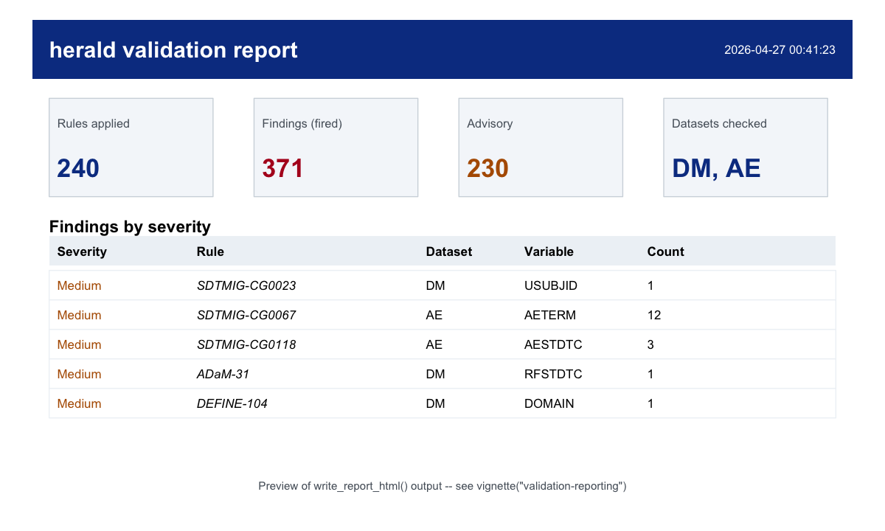

---
output:
  github_document:
    html_preview: false
---

<!-- README.md is generated from README.Rmd. Please edit that file -->

```{r, include = FALSE}
knitr::opts_chunk$set(
  collapse = TRUE,
  comment = "#>",
  fig.path = "man/figures/README-",
  out.width = "100%"
)
```

# herald

<!-- badges: start -->
[](https://lifecycle.r-lib.org/articles/stages.html#experimental)
[](https://github.com/vthanik/herald/actions/workflows/R-CMD-check.yaml)
[](https://app.codecov.io/gh/vthanik/herald?branch=main)
[](https://vthanik.github.io/herald/)
[](https://cran.r-project.org/)
[](https://opensource.org/licenses/MIT)
<!-- badges: end -->

> Pure-R conformance validation for CDISC clinical data submissions. Reads SDTM and ADaM datasets from XPT, Dataset-JSON, and Parquet files, checks them against published CDISC Library rules, controlled terminology, and Define-XML 2.1 specs. No Java runtime required.

`herald` is a pure-R package for teams that need reproducible submission
checks without a Java desktop validator. It reads clinical datasets, stamps
metadata from a submission specification, runs SDTM, ADaM, and Define-XML
rules, and writes review-ready reports.

Status: pre-alpha. APIs can still change while the rule engine and
Define-XML round-trip are being completed.

## Why herald?

Clinical submission validation usually crosses several tools: SAS transport
writers, spreadsheet specs, Define-XML tooling, controlled terminology
lookups, Java validators, and hand-built reports. `herald` puts the core
workflow in one auditable R pipeline.

| Capability | herald |
|---|---|
| Pure-R validation path | No JVM or desktop validator required for package workflows |
| Dataset I/O | XPT, Dataset-JSON, and Parquet readers/writers |
| Single metadata object | `herald_spec` drives labels, lengths, types, and Define-XML |
| Rule transparency | `rule_catalog()` exposes every compiled rule and predicate state |
| Dictionary protocol | CDISC CT, SRS, MedDRA, WHODrug, LOINC, SNOMED, and sponsor dictionaries use one interface |
| Reports | HTML for review, XLSX for triage, JSON for automation |
| Define-XML | Read/write round-trip for Define-XML 2.1 and reviewer HTML |

## Compare to Pinnacle 21

| Dimension              | herald                                  | Pinnacle 21 (Community / Enterprise) |
|------------------------|-----------------------------------------|--------------------------------------|
| Engine                 | Pure R (no JVM)                         | Java (JVM required)                  |
| Cost                   | Open source (MIT)                       | Community free / Enterprise commercial |
| Extensibility          | `.register_op()` + YAML rule corpus     | Closed rule engine                   |
| Define-XML round-trip  | Read + write + reviewer HTML            | Read + reviewer HTML                 |
| Dictionary protocol    | Pluggable provider interface            | Built-in lookups                     |
| Output formats         | HTML, XLSX, JSON                        | HTML, XLSX                           |
| CI / `targets` / `renv`| First-class (pure R)                    | External tool invocation             |

## Pipeline verbs

| Workflow step | Primary function |
|---|---|
| Read datasets | `read_xpt()`, `read_json()`, `read_parquet()` |
| Build or load specs | `as_herald_spec()`, `herald_spec()`, `read_define_xml()` |
| Stamp labels, lengths, and types | `apply_spec()` |
| Validate submissions | `validate()` |
| Inspect rule coverage | `rule_catalog()`, `supported_standards()` |
| Use controlled terminology | `load_ct()`, `ct_provider()` |
| Write reports | `report()`, `write_report_html()`, `write_report_xlsx()`, `write_report_json()` |
| Author Define-XML | `write_define_xml()`, `write_define_html()` |
| Convert formats | `convert_dataset()` |

## Installation

`herald` is not on CRAN yet.

```r
# from GitHub (recommended while pre-CRAN)
pak::pak("vthanik/herald")

# or from a local clone
pak::local_install()

# after the first public release
install.packages("herald")
```

## Five-minute workflow

This example uses the lazy-loaded pilot datasets shipped with the package
(`dm`, `adsl`, `adae`, `advs`).

```{r quickstart, results = "markup"}
library(herald)

r <- validate(files = list(DM = dm, AE = adae))
summary(r)
write_report_html(r, tempfile(fileext = ".html"))
```

## What you get

The HTML report opens with a header band, summary tiles, and a sortable
findings table grouped by severity, rule, and dataset.



Write the same result to other formats:

```r
report(r, "validation-report.html")
report(r, "validation-report.xlsx")
report(r, "validation-report.json")
```

Convert between transport formats:

```r
write_xpt(dm, "dm.xpt")
convert_dataset("dm.xpt", "dm.json")
```

## Key features

### Transparent rule corpus

```r
catalog <- rule_catalog()
catalog[catalog$has_predicate, c("rule_id", "standard", "severity", "message")]
supported_standards()
```

### Controlled terminology in the same pipeline

```r
ct <- ct_provider("sdtm")
ct$contains(c("Y", "N", "UNKNOWN"), field = "NY")

validate(
  files = dm,
  dictionaries = list("ct-sdtm" = ct),
  quiet = TRUE
)
```

### One result, three report formats

```r
report(r, "qc/report.html")
report(r, "qc/report.xlsx")
report(r, "qc/report.json")
```

### Define-XML round-trip

```r
write_define_xml(sdtm_spec, "define.xml", validate = FALSE)
define <- read_define_xml("define.xml")
write_define_html(sdtm_spec, "define.html", define_xml = "define.xml")
```

## Documentation

Start with these vignettes:

- `vignette("herald")`: end-to-end package workflow
- `vignette("validation-reporting")`: validation, filtering, and reports
- `vignette("data-io")`: XPT, Dataset-JSON, Parquet, and conversion
- `vignette("define-xml")`: Define-XML 2.1 read/write round-trip
- `vignette("dictionaries")`: controlled terminology and dictionary providers
- `vignette("best-practices")`: production validation project patterns
- `vignette("architecture")`: package layers and extension points
- `vignette("rule-coverage")`: rule fixture coverage status

## Development checks

Run these before committing package changes:

```bash
Rscript -e 'devtools::document()'
Rscript -e 'devtools::test()'
Rscript -e 'devtools::check(args = "--no-manual")'
```

Generated files such as `man/*.Rd`, `NAMESPACE`, and compiled rule artifacts
should be regenerated from source, not hand-edited.

## License

MIT. Rule content is authored independently from CDISC Library material and
primary regulator documents. See `LICENSE.md` and `inst/NOTICE` when present.
